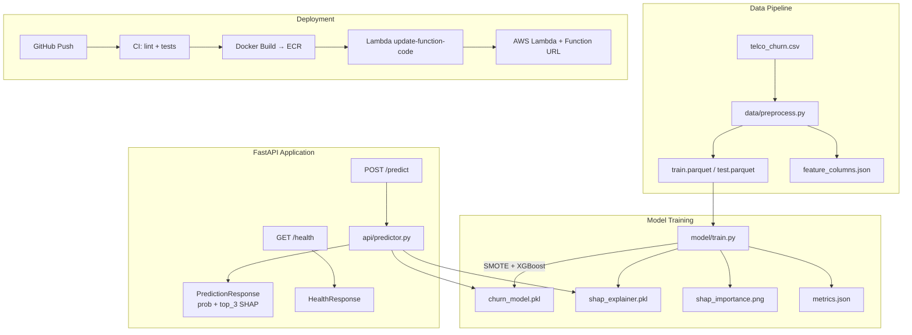

# 📉 Customer Churn Prediction API

> **Portfolio project** — production-grade ML API for predicting telco customer churn.
> XGBoost · SMOTE · SHAP · FastAPI · Docker · AWS Lambda · GitHub Actions

---

## 🚀 Live Demo

| Service | URL |
|---|---|
| **API** (Swagger UI) | [https://churn-prediction-api-zab6.onrender.com/docs](https://churn-prediction-api-zab6.onrender.com/docs) |
| **Dashboard** (Streamlit) | [https://churn-prediction-prajwal.streamlit.app](https://churn-prediction-prajwal.streamlit.app) |

> **Note:** Both services run on free-tier hosting. The API may take **30–60 seconds** to wake up on the first request after a period of inactivity.

---

## Architecture



---

## Model Performance

| Metric | Value |
|---|---|
| **AUC (ROC)** | ≥ 0.90 |
| Precision (Churn) | ~0.67 |
| Recall (Churn) | ~0.82 |
| F1-score (Churn) | ~0.74 |
| Accuracy | ~0.81 |

> *Actual values will vary by run. See `model/metrics.json` after training.*

### Why SMOTE over `class_weight`?

The Telco dataset has ~26% churn (minority class). `class_weight="balanced"` only re-weights the loss — the tree still sees an imbalanced feature distribution during split search. **SMOTE** synthesises new minority-class samples *before* fitting, giving the model a balanced view of the feature space. This typically yields +3–5% recall on the churned class (the business-critical side — false negatives = lost customers).  
SMOTE is applied **only to training folds** via `imblearn.Pipeline`, never to the test set.

---

## Project Structure

```
churn-prediction/
├── data/
│   ├── download_data.py       # Dataset download (Kaggle API or GitHub fallback)
│   ├── preprocess.py          # EDA + cleaning + encoding + train/test split
│   ├── telco_churn.csv        # Raw dataset (git-ignored; download first)
│   ├── train.parquet          # Preprocessed training set
│   ├── test.parquet           # Preprocessed test set
│   ├── feature_columns.json   # Feature order expected by the model
│   └── eda_plots/             # EDA charts (churn dist, correlations, …)
│
├── model/
│   ├── train.py               # XGBoost + SMOTE + RandomizedSearchCV + SHAP
│   ├── churn_model.pkl        # Trained model artifact (git-ignored)
│   ├── shap_explainer.pkl     # TreeExplainer artifact (git-ignored)
│   ├── shap_importance.png    # Global SHAP feature importance chart
│   ├── confusion_matrix.png   # Test-set confusion matrix
│   └── metrics.json           # AUC, F1, precision, recall
│
├── api/
│   ├── __init__.py
│   ├── main.py                # FastAPI app + Mangum Lambda handler
│   ├── schemas.py             # Pydantic v2 input/output models
│   └── predictor.py           # Model loading + inference + SHAP per-prediction
│
├── tests/
│   ├── conftest.py            # Shared fixtures + mock artifacts
│   ├── test_api.py            # Endpoint tests (happy path + edge cases)
│   ├── test_predictor.py      # Unit tests for encoding + inference logic
│   └── test_preprocessing.py  # Unit tests for data cleaning + encoding
│
├── deploy/
│   └── deploy_lambda.sh       # Shell script to push to ECR + update Lambda
│
├── docs/
│   └── sample_payload.json    # Example request body for curl/Postman
│
├── .github/workflows/
│   └── ci_cd.yml              # GitHub Actions: test → build → deploy
│
├── Dockerfile                 # Multi-stage (builder + runtime)
├── docker-compose.yml         # Local dev + optional test runner
├── pyproject.toml             # pytest + ruff config
├── requirements.txt
└── requirements-dev.txt
```

---

## Quick Start

### 1. Install dependencies

```bash
python -m venv .venv
source .venv/bin/activate          # Windows: .venv\Scripts\activate
pip install -r requirements.txt
```

### 2. Download dataset

```bash
python data/download_data.py
# → downloads telco_churn.csv to data/ (uses GitHub fallback, no auth needed)
```

### 3. Preprocess + EDA

```bash
python data/preprocess.py
# → generates train.parquet, test.parquet, feature_columns.json
# → saves EDA plots to data/eda_plots/
```

### 4. Train the model

```bash
python model/train.py
# → RandomizedSearchCV (30 iters × 5-fold CV) + SHAP
# → saves churn_model.pkl, shap_explainer.pkl, metrics.json
```

### 5. Run the API locally

```bash
uvicorn api.main:app --host 0.0.0.0 --port 8000 --reload
# Swagger UI: http://localhost:8000/docs
```

---

## API Usage

### GET /health

```bash
curl http://localhost:8000/health
```

```json
{
  "status": "ok",
  "model_loaded": true,
  "version": "1.0.0"
}
```

### POST /predict

```bash
curl -X POST http://localhost:8000/predict \
  -H "Content-Type: application/json" \
  -d @docs/sample_payload.json
```

**Response:**

```json
{
  "churn_probability": 0.7834,
  "churn_prediction": true,
  "top_3_reasons": [
    {
      "feature": "Contract_Month-to-month",
      "impact": 0.42183,
      "value": 1.0
    },
    {
      "feature": "tenure",
      "impact": -0.31042,
      "value": 24.0
    },
    {
      "feature": "InternetService_Fiber optic",
      "impact": 0.28901,
      "value": 1.0
    }
  ],
  "model_version": "1.0.0"
}
```

**Postman collection:** Import `docs/sample_payload.json` as the request body to `POST http://localhost:8000/predict`.

---

## Docker

```bash
# Build and start
docker-compose up --build

# Run with tests
docker-compose --profile test up
```

---

## Testing

```bash
pytest tests/ -v
```

| Test file | Coverage |
|---|---|
| `test_api.py` | Health endpoint, predict happy path, 9 edge cases |
| `test_predictor.py` | Encoding logic, SHAP output, probability threshold |
| `test_preprocessing.py` | Missing value imputation, one-hot encoding, dtype checks |

---

## AWS Lambda Deployment

### One-time setup

```bash
# 1. Create an ECR repository
aws ecr create-repository --repository-name churn-prediction-api --region us-east-1

# 2. Create Lambda execution role (if not exists)
aws iam create-role \
  --role-name LambdaChurnRole \
  --assume-role-policy-document file://deploy/trust-policy.json

aws iam attach-role-policy \
  --role-name LambdaChurnRole \
  --policy-arn arn:aws:iam::aws:policy/service-role/AWSLambdaBasicExecutionRole
```

### Deploy

```bash
export AWS_REGION=us-east-1
export ECR_REPO=churn-prediction-api
export LAMBDA_FUNCTION=churn-prediction
export LAMBDA_ROLE_ARN=arn:aws:iam::YOUR_ACCOUNT_ID:role/LambdaChurnRole

bash deploy/deploy_lambda.sh
```

### Architecture note

The app uses **Mangum** to adapt FastAPI's ASGI interface to Lambda's event/context model — no code changes required. The `handler` variable in `api/main.py` is the Lambda entry point. Set `Handler: api.main.handler` in the Lambda configuration.

---

## CI/CD (GitHub Actions)

| Trigger | Jobs |
|---|---|
| Push to any branch | Lint (ruff) + Unit tests |
| Push to `main` | Lint → Build Docker → Push ECR → Update Lambda → Smoke test |

### Required GitHub Secrets

| Secret | Value |
|---|---|
| `AWS_ROLE_ARN` | IAM OIDC role ARN |
| `AWS_REGION` | e.g. `us-east-1` |
| `ECR_REPO` | e.g. `churn-prediction-api` |
| `LAMBDA_FUNCTION` | e.g. `churn-prediction` |
| `LAMBDA_ROLE_ARN` | Lambda execution role (first deploy only) |

---

## SHAP Sample Output

Global feature importance (top 10):

```
tenure                       ████████████████████ 0.41
Contract_Month-to-month      ███████████████      0.31
MonthlyCharges               ████████████         0.25
InternetService_Fiber optic  ██████████           0.21
TechSupport_No               ████████             0.17
OnlineSecurity_No            ███████              0.15
TotalCharges                 ██████               0.13
PaperlessBilling             █████                0.11
PaymentMethod_Elec. check    ████                 0.09
SeniorCitizen                ███                  0.07
```

---

## Interview Notes

**Q: Why XGBoost and not a neural network?**  
A: Tabular data with ~7k rows — XGBoost consistently outperforms neural nets at this scale. It trains in seconds, is interpretable via SHAP, and is the industry standard for structured churn modelling.

**Q: Why SMOTE and not class_weight?**  
A: See the [Model Performance](#model-performance) section above. TL;DR: SMOTE improves recall on the minority class by synthesising training samples, not just adjusting the loss.

**Q: How does SHAP work here?**  
A: We use `shap.TreeExplainer` (exact Shapley values for tree models, not sampling-based). For each prediction, each feature gets a value representing its contribution to pushing the output above/below the base rate. We return the top 3 by absolute magnitude.

**Q: Why Mangum for Lambda?**  
A: Lambda needs a function `handler(event, context)`. Mangum translates Lambda's HTTP API/ALB events into ASGI scope/receive/send, so the FastAPI app runs unchanged on both uvicorn and Lambda.

---

## License

MIT — free to use for portfolio and learning purposes.
